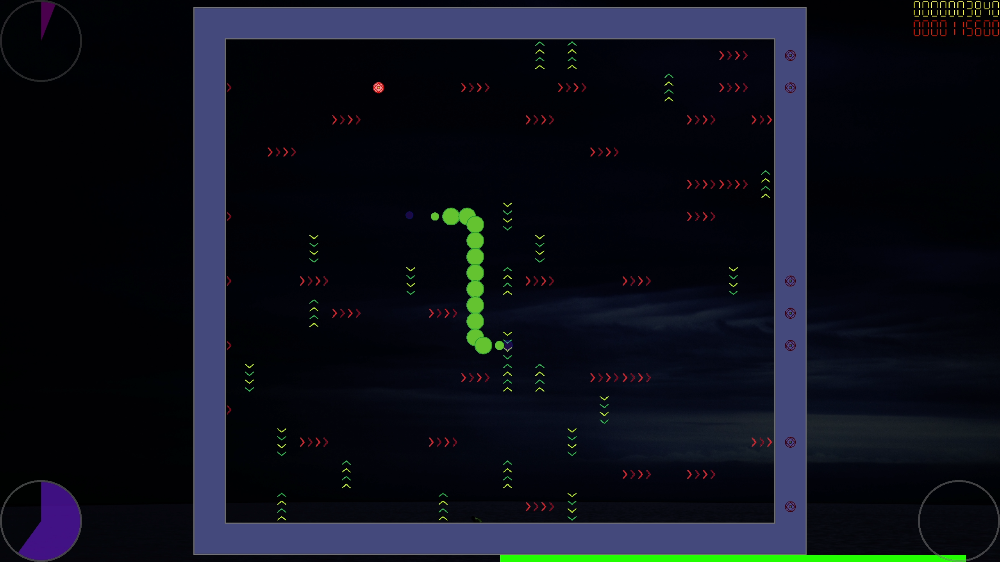

## Snatan

⛧ Puzzle-like levels of two difficulties 
⛧ Cool design 
⛧ Outstanding soundtrack borrowed from [Kevin MacLeod](http://incompetech.com/) (see the [credits](Resources/Music/license.txt))

## Presentation

Click the link below to see the gameplay:

## Installation on Windows

- 1. Download the [SFML](https://www.sfml-dev.org/files/SFML-2.6.1-windows-vc17-32-bit.zip) package
- 2. Copy SFML's "include" contents to <kbd>C:\Libs\SFML-2.6.1\include</kbd> folder
- 3. Copy SFML's "lib" contents to <kbd>C:\Libs\SFML-2.6.1\lib_x86</kbd> folder
- 4. Open the VS solution
- 5. Set the configuration to "Release|x86"
- 6. Build the solution
- 7. Copy SFML's "bin" contents to the "Release" folder where the executive is generated
- 8. Copy or move the "Resources" folder to the "Release" folder
- 9. Start the application

## Installation on Linux

To install the app on Linux via terminal, execute the following commands with <kbd>pwd</kbd> set to the main directory. Assure that you have [SFML](http://sfml-dev.org) 2.6.1 installed.

- <kbd>$ make</kbd> to compile and link

- <kbd>$ ./snatan</kbd> to play

**Note**: if you use the external SFML package, add <kbd>-I[SFML include directory]</kbd> and <kbd>-L[SFML lib directory]</kbd> options to <kbd>g++ [...]</kbd> line in the *Makefile* and execute <kbd>export LD_LIBRARY_PATH=[SFML lib directory]</kbd> command before launching the application.

## Screenshots

